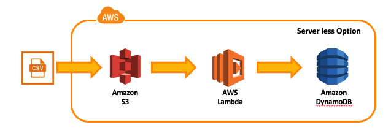

Serverless Application using Lambda on AWS
=================================



## Introduction

This application reads the `csv` from `AWS S3` and put the records in `AWS Dynamodb` table.
The implementation is bound to a single file containing one handler (a.k.a. lamda_handler)
which gets invoked if a file with `.csv` extension gets upload to s3.
The code for lambda_function is written in Python which calls supporting custom written 
method `read_csv_from_s3` and `add_record`.


```python
def lambda_handler(event, context):

    bucket = event['Records'][0]['s3']['bucket']['name']
    key = event['Records'][0]['s3']['object']['key']

    data = read_csv_from_s3(bucket, key)

    for record in data:
        add_record(record, table="user-travel-history")

    return {
        'statusCode': 200,
        'body': json.dumps("CSV uploaded to DynamoDb Successfully")
    }

```

The [Terraform configuration](infra/main.tf) contains:
1. `S3 bucket` with `ACL` for .csv file
2. `IAM Role` for Lambda with inline policy 
3. `Lambda Function` with `S3` trigger
4. `DynamoDB` for storing csv data


<!-- GETTING STARTED -->
## Getting Started

You must have an AWS account and have access to deploy following infrastructure i.e
1. `S3 bucket`
2. `IAM Role and Policy`
3. `Lambda Function`
4. `DynamoDB Table`

. Next, you must complete the prerequisites first.

<!-- Prerequisites -->
### Prerequisites

In order to test the script and run infrastructure locally, you need to install provided below:  
* Python 3.9
    * virtualenv
    * pip
    
* Terraform
    * version >= 1.13

<!-- Prerequisites -->
#### Installation Steps:

Before you go any further, make sure you have `Python` and that it’s available from your command line.
You can check this by simply running:

```sh
python --version
```

If you do not have Python, please install the latest 3.x version from python.org

Additionally, you’ll need to make sure you have pip available. You can check this by running:

```sh
pip --version
```

##### Next steps

Install `virtualenv` via pip:
```sh
pip install virtualenv
```

Create a virtual environment for a cloning the project:
```sh
git clone https://github.com/Hatim53/serverless-app.git
cd src
virtualenv venv
```

Enable the virtual environment 
```sh
source venv/bin/activate
```

Install the python dependencies on the virtual environment
```sh
pip install -r requirements.txt
```

<!-- Steps -->
### Steps

Once you've completed your prerequisites, Please follow the below steps to run 

1. Build the app
   ```sh
   make build-app
   ```
2. Deploy the app
   ```sh
   make deploy-lambda
   ```

<!-- LICENSE -->
## License

Distributed under the MIT License. See `LICENSE.txt` for more information.
